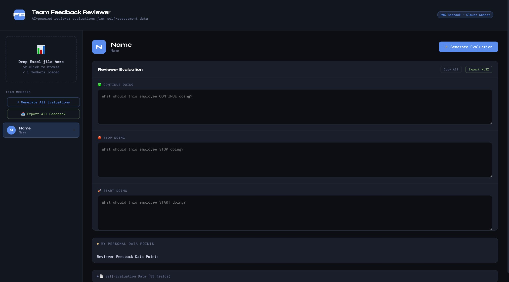

# Team Feedback Reviewer

AI-powered reviewer evaluations from team self-assessment data. Upload an Excel feedback sheet, pick a team member, and generate **Continue / Stop / Start** evaluation text using Claude on **AWS Bedrock**.



## Prerequisites

- **Node.js** 20+
- **AWS account** with access to Amazon Bedrock and the Claude Sonnet model
- An **Excel file** (`.xlsx`) with your team’s self-assessment (see expected format below)

## Setup

1. **Clone or download** this folder.

2. **Install dependencies:**
   ```bash
   npm install
   ```

3. **Configure AWS** (pick one):
   - **Environment variables:**  
     `AWS_ACCESS_KEY_ID`, `AWS_SECRET_ACCESS_KEY`, and optionally `AWS_REGION`
   - **Default profile:**  
     `aws configure` (or existing `~/.aws/credentials`)

4. **Enable Claude on Bedrock** (if needed):  
   In the [AWS Bedrock console](https://console.aws.amazon.com/bedrock/), enable **Anthropic Claude** in your region.

## Running the app

```bash
npm start
```

Then open **http://localhost:3001/** in your browser.

- Upload your Excel file (or try the included **Sample.xlsx**).
- Click a team member in the sidebar.
- Click **Generate Evaluation** to create Continue / Stop / Start feedback via Claude.
- Edit the text if needed, then **Copy All** or **Export XLSX**.

## Environment variables

| Variable | Default | Description |
|----------|---------|-------------|
| `PORT` | `3001` | Server port |
| `AWS_REGION` | `us-east-1` | AWS region for Bedrock |
| `AWS_ACCESS_KEY_ID` | — | AWS access key (or use default profile) |
| `AWS_SECRET_ACCESS_KEY` | — | AWS secret key (or use default profile) |
| `BEDROCK_MODEL_ID` | `anthropic.claude-sonnet-4-20250514-v1:0` | Bedrock model ID (e.g. another Claude Sonnet variant) |

## Excel format

**Sample file:** Use `Sample.xlsx` in this repo as a reference for the expected layout.

The tool expects a sheet where:

- **Column B** – team member email
- **Columns C–AJ** – self-evaluation fields (headers in row 1)
- **Column AK** – manager notes / personal data points
- **Columns AL–AN** – optional pre-filled Continue / Stop / Start (can be overwritten by generation)

Row 1 is headers; data starts at row 2.

## Tech

- **Frontend:** Single HTML file (no build step), vanilla JS, XLSX.js for Excel.
- **Backend:** Node.js HTTP server that proxies requests to **AWS Bedrock** (Claude Sonnet) so the API key never touches the browser.
